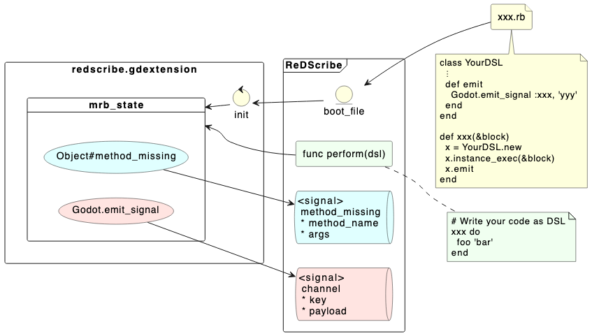

# ReDScribe
Let’s re-describe your code as your own friendly domain-specific language.


> [!CAUTION]
> This project is currently in an experimental stage and may undergo significant changes.
> > まだ他人が使えるほど親切な状態にはなっていません。プラグインとして公開されるまで気長にお待ち下さい。


## Usage
```gdscript
extends Node

@onready var res := ReDScribe.new()

func _ready() -> void:
    res.method_missing.connect(_method_missing)
    res.channel.connect(_subscribe)
    res.perform("""
        Alice speak: "Hello Ruby!"

        require 'src/lib/player' # DSL definition file.

        player 'Alice' do
          level 1
          job   :magician
        end
    """)

func _method_missing(method_name: String, args: Array) -> void:
    print_debug('[method_missing] ', method_name, ': ', args)

func _subscribe(key: StringName, payload: Variant) -> void:
    print_debug('[subscribe] ', key, ': ', payload)


# -- Output --
#
#   [method_missing] Alice: [{ &"speak": "Hello Ruby!" }]
#
#   [subscribe] add_player: { &"name": "Alice", &"level": 1, &"job": &"magician" }
#
```

## Architecture



## Built-in methods

| mruby                             | description                          |
|-----------------------------------|--------------------------------------|
| `require 'path/to/file'`          | loads `res://path/to/file.rb` file.  |
| `puts 'something'`                | prints `something` in Godot console. |
| Object#method_missing             | emits `method_missing` signal.<br> `(method_name: String, args: Array)` |
| `Godot.emit_signal(key, payload)` | emits `channel` signal.<br> `(key: StringName, payload: Variant)`       |
| `Godot::VERSION`                  | Godot version                        | 


## Type conversions

| mruby      | gdscript   |
|------------|------------|
| true       | true       |
| false      | false      |
| nil        | null       |
| Float      | float      |
| Integer    | int        |
| Symbol     | StringName |
| String     | String     |
| Hash       | Dictionary |
| Array      | Array      |
| (others)   | null       |


## Roadmap

### v0.1.0
* [x] method_missing signal
* [x] channel signal
* [x] Godot module
* [x] puts
* [x] boot.rb
* [x] require
* [ ] create as a plugin
  * [x] Editor
* [ ] Document
  * [x] doc/*.adoc
  * [ ] README
  * [ ] Wiki
  * [x] Godot help
* [ ] Demo


### v0.2.0
* [ ] Editor
  * [ ] User definable theme
  * [ ] User definable syntax
* [ ] REPL
* [ ] compile
  * [ ] target
    * [x] windows.x86_64 
    * [ ] windows.x86_32 
    * [x] macos
    * [ ] linux.x86_64 
    * [ ] linux.arm64 
    * [ ] linux.rv64 
    * [ ] android.x86_64 
    * [ ] android.arm64 
    * [ ] ios


