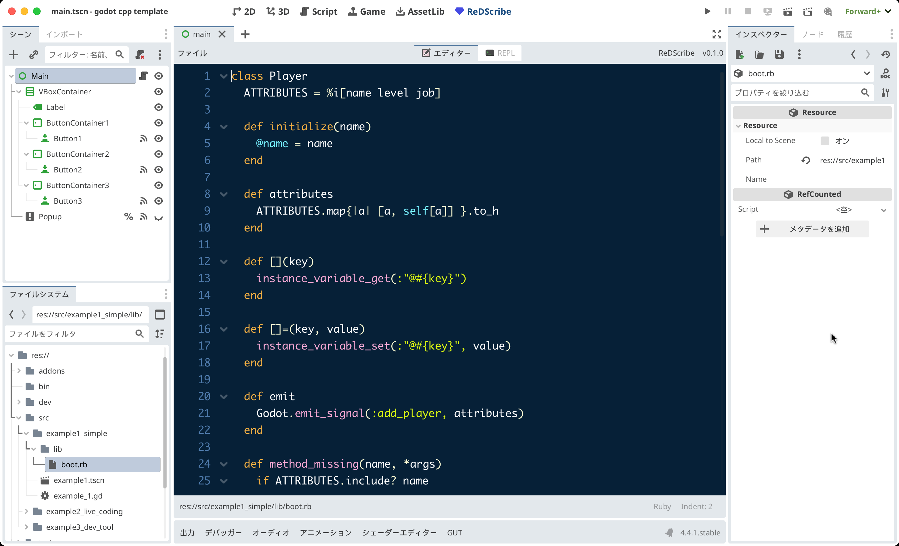
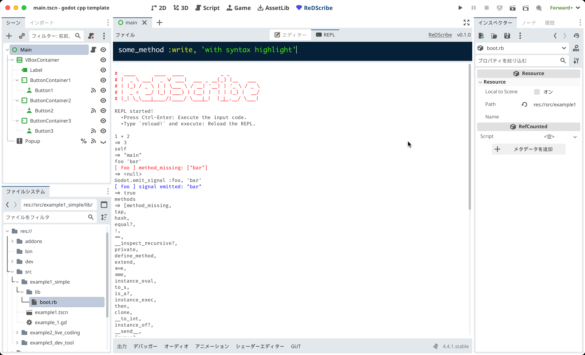

# ReDScribe
Let’s re-describe your code as your own friendly domain-specific language.


#### Features:
* **Execution**: You can execute mruby code (a lightweight Ruby) in Godot and emit signals from mruby to Godot.
* **Editing**: You can write and edit Ruby files in the Godot Editor.
* **REPL**: You can try out Ruby interactively in Godot.


## Usage
```gdscript
extends Node

@onready var res := ReDScribe.new()

func _ready() -> void:
    res.method_missing.connect(_method_missing)
    res.channel.connect(_subscribe)
    res.perform("""

        Alice says: "Hello Ruby! ❤️"

        puts "Welcome to the world of Ruby v#{RUBY_VERSION}, powered by #{RUBY_ENGINE} 💎"

        Godot.emit_signal :spawn, { name: 'Alice', job: 'wizard', level: 1 }

    """)

func _method_missing(method_name: String, args: Array) -> void:
    print_debug('[method_missing] ', method_name, ': ', args)

func _subscribe(key: StringName, payload: Variant) -> void:
    print_debug('[subscribe] ', key, ': ', payload)


# -- Output --
#
#   [method_missing] Alice: [{ &"says": "Hello Ruby! ❤️" }]
#
#   Welcome to the world of Ruby v3.4, powered by mruby 💎
#
#   [subscribe] spawn: { &"name": "Alice", &"job": "wizard", &"level": 1 }
#
```

## Architecture


## Definitions

* *Properties*
  * String **boot_file**
  * String **exception**
* *Methods*
  * void **set_boot_file**(path: String)
  * void **perform**(dsl: String)
* *Signals*
  * **channel**(key: StringName, payload: Variant)
  * **method_missing**(method_name: String, args: Array)


## Built-in mruby methods

| mruby                             | description                          |
|-----------------------------------|--------------------------------------|
| `require 'path/to/file'`          | loads `res://path/to/file.rb` file.  |
| `puts 'something'`                | prints `something` in Godot console. |
| Object#method_missing             | emits `method_missing` signal.<br> `(method_name: String, args: Array)` |
| `Godot.emit_signal(key, payload)` | emits `channel` signal.<br> `(key: StringName, payload: Variant)`       |
| `Godot::VERSION`                  | Godot version                        |


## Type conversions

| mruby      |   | GDScript                    |
|------------|---|-----------------------------|
| true       | ⇒ | true                        |
| false      | ⇒ | false                       |
| nil        | ⇒ | null                        |
| Float      | ⇒ | float                       |
| Integer    | ⇒ | int                         |
| Symbol     | ⇒ | StringName                  |
| String     | ⇒ | String                      |
| Hash       | ⇒ | Dictionary                  |
| Array      | ⇒ | Array                       |
| Range      | ⇒ | Array                       |
| Time       | ⇒ | Dictionary                  |
| (others)   | ⇒ | String<br>(#inspect called) |

see: [demo/test/gdextension/test_variant.gd](https://github.com/tkmfujise/ReDScribe/blob/main/demo/test/gdextension/test_variant.gd)


## Installation
1. Download the zip from the release.
2. Extract the zip and place the `(Your godot project root)/addons/redscribe` directory.
3. Open the project settings and enable `ReDScribe`.


## Screenshots

### Editor


> [!NOTE]
> For `@` and `:`, syntax highlighting requires a following whitespace to work correctly.

### REPL


> [!CAUTION]
> In the REPL, local variables are undefined in the next input.


## addons/redscribe/mrblib

I have created some libraries.
If you'd like to use them, add `require 'addons/redscribe/mrblib/xxx'` at the top of your script.

### actor
```ruby
require 'addons/redscribe/mrblib/actor'

actor 'Counter' do
  @number = 0
  --> { @number += 1 }
  :reset --> { @number = 0 }
end

# `tick` => [ Counter ] signal emitted: { &"number": 1, &"name": "Counter" }
# `tick` => [ Counter ] signal emitted: { &"number": 2, &"name": "Counter" }
#
# `notify :reset`
# `tick` => [ Counter ] signal emitted: { &"number": 1, &"name": "Counter" }
#
# `tell 'Counter', :reset`
# `tick` => [ Counter ] signal emitted: { &"number": 1, &"name": "Counter" }
#
# `ask 'Counter', :number` # => 1
```
see more:
* [demo/addons/redscribe/mrblib/actor.rb](https://github.com/tkmfujise/ReDScribe/blob/main/demo/addons/redscribe/mrblib/actor.rb)
* [demo/test/mrblib/test_actor.gd](https://github.com/tkmfujise/ReDScribe/blob/main/demo/test/mrblib/test_actor.gd)


### coroutine
```ruby
require 'addons/redscribe/mrblib/coroutine'

coroutine do
  loop do
    emit! :given, ___?
  end
end

# `start`         # When `___?` called, it stops until the next continue.
# `continue`      => [ given ] signal emitted: true
# `continue 123`  => [ given ] signal emitted: 123
```
```ruby
require 'addons/redscribe/mrblib/coroutine'

coroutine 'Foo' do
  emit! :foo, :started
  while ___?
    emit! :foo, :progress
  end
  emit! :foo, :finished
end

coroutine 'Bar' do
  emit! :bar, :started
  while ___?
    emit! :bar, :progress
  end
  emit! :bar, :finished
end

# `start :all`          # all coroutine start
#                       => [ foo ] signal emitted: &"started"
#                       => [ bar ] signal emitted: &"started"
# `resume 'Foo'`        => [ foo ] signal emitted: &"progress"
# `resume 'Bar', true`  => [ bar ] signal emitted: &"progress"
# `resume 'Foo', false` => [ foo ] signal emitted: &"finished"
# `resume 'Bar', false` => [ bar ] signal emitted: &"finished"
```
see more:
* [demo/addons/redscribe/mrblib/coroutine.rb](https://github.com/tkmfujise/ReDScribe/blob/main/demo/addons/redscribe/mrblib/coroutine.rb)
* [demo/test/mrblib/test_coroutine.gd](https://github.com/tkmfujise/ReDScribe/blob/main/demo/test/mrblib/test_coroutine.gd)


### math
```ruby
require 'addons/redscribe/mrblib/math'

sin(π) # => 0.0
√(2)   # => 1.41421356237309
```
see more:
* [demo/addons/redscribe/mrblib/math.rb](https://github.com/tkmfujise/ReDScribe/blob/main/demo/addons/redscribe/mrblib/math.rb)
* [demo/test/mrblib/test_math.gd](https://github.com/tkmfujise/ReDScribe/blob/main/demo/test/mrblib/test_math.gd)


### resource
```ruby
require 'addons/redscribe/mrblib/resource'
resource :stage do
  resource :image
  resources :chapter => :chapters
end

stage 'First' do
  number 1
  music  'first_stage.mp3'

  image do
    path 'first_stage.png'
  end

  chapter do
    name  'Chapter1'
    image 'path/to/chapter1.png'
  end

  chapter do
    name  'Chapter2'
    image 'path/to/chapter2.png'
  end
end

# => [ stage ] signal emitted:
# {
#   &"number": 1,
#   &"music": "first_stage.mp3",
#   &"name":  "First",
#   &"image": {
#     &"path": "first_stage.png",
#     &"name": "image_6308476176"
#   },
#   &"chapters": [
#     {
#       &"image": "path/to/chapter1.png",
#       &"name":  "Chapter1"
#     },
#     {
#       &"image": "path/to/chapter2.png",
#       &"name":  "Chapter2"
#     }
#   ]
# }
```
see more:
* [demo/addons/redscribe/mrblib/resource.rb](https://github.com/tkmfujise/ReDScribe/blob/main/demo/addons/redscribe/mrblib/resource.rb)
* [demo/test/mrblib/test_resource.gd](https://github.com/tkmfujise/ReDScribe/blob/main/demo/test/mrblib/test_resource.gd)


### shell
```ruby
require 'addons/redscribe/mrblib/shell'

cd 'addons' do
  sh 'ls -lA'
end
# Execute the shell command `ls -lA` in the addons directory.
```
see more:
* [demo/addons/redscribe/mrblib/shell.rb](https://github.com/tkmfujise/ReDScribe/blob/main/demo/addons/redscribe/mrblib/shell.rb)
* [demo/test/mrblib/test_shell.gd](https://github.com/tkmfujise/ReDScribe/blob/main/demo/test/mrblib/test_shell.gd)


## Examples

### 1. Live coding
Create a scene as below. [ReDScribeEditor](https://github.com/tkmfujise/ReDScribe/blob/main/demo/addons/redscribe/src/editor/editor.gd) is a Node implementation for editing Ruby files in Godot.
```
Control
  └ HBoxContainer
      ├ ReDScribeEditor
      └ RichTextLabel
```
Then attach a GDScript.
```gdscript
extends Control

@onready var dsl := ReDScribe.new()

func _ready() -> void:
    dsl.method_missing.connect(_method_missing)
    %ReDScribeEditor.grab_focus()
    perform()

func perform() -> void:
    %RichTextLabel.text = ''
    dsl.perform(%ReDScribeEditor.text)

func add_circle() -> void:
    %RichTextLabel.text += '◯'

func add_square() -> void:
    %RichTextLabel.text += '■'

func _method_missing(method_name: String, args: Array) -> void:
    match method_name:
        'circle': add_circle()
        'square': add_square()
        _: return

func _on_re_d_scribe_editor_text_changed() -> void:
    perform()
```
[](https://www.youtube.com/watch?v=FUZ-38F44i4)


### 2. Resource generator

I have created a DSL( [demo/addons/redscribe/mrblib/resource.rb](https://github.com/tkmfujise/ReDScribe/blob/main/demo/addons/redscribe/mrblib/resource.rb) ).


```ruby
# TODO
```

```gdscript
# TODO
```


### 3. Concurrency (like Agent-based model)

I have created a DSL( [demo/addons/redscribe/mrblib/actor.rb](https://github.com/tkmfujise/ReDScribe/blob/main/demo/addons/redscribe/mrblib/actor.rb) ).

`-->{ do_something }` is a unit of execution, and defined execution units run in a loop.

`notify :message` broadcasts the message to all actors.
`tell 'ActorName', :message` tells the message to the actor named ActorName.

Call `tick` from a GDScript, then each actor will execute the next step in the cycle and emit a signal containing all instance variables (e.g., `@speed`) as a Dictionary.


Create a *boot.rb* file.
```ruby
require 'addons/redscribe/mrblib/actor'

actor 'Weather' do
  @current = :sunny
  --> {
    @current = (rand < 0.3) ? :raining : :sunny
    notify @current
  }
  2.times{ -->{ keep } }
end

actor 'Rabbit' do
  @position = 0
  @speed    = 150
  --> { run unless @wait }
  :sunny   --> { @wait = false }
  :raining --> { @wait = true }

  def run
    @position += @speed * rand
  end
end

actor 'Turtle' do
  @position = 0
  @speed    = 1
  --> { run }
  :cheer --> { @speed += 1 }

  def run
    @position += @speed
  end
end
```

Then, create a GDScript file and set the `boot_file` property of the `pod` instance in the `ReDScribe` class to *boot.rb*.
```gdscript
extends Control

signal game_over(actor_name: String)
@export var pod : ReDScribe

func _ready() -> void:
    pod.channel.connect(_observe)

func _observe(key: StringName, attributes: Dictionary) -> void:
    match key:
        'Rabbit': %Rabbit.update(attributes)
        'Turtle': %Turtle.update(attributes)
        'Weather':
            if attributes['current'] == &'raining':
                %Weather.label = '⛈️'
            else:
                %Weather.label = '☀️'
        _: return

func _on_timer_timeout() -> void:
    pod.perform('tick')

func _on_cheer_button_pressed() -> void:
    pod.perform('tell "Turtle", :cheer')

func _on_goal_area_entered(area: Area2D) -> void:
    var actor = area.get_parent()
    match actor.name:
        'Rabbit', 'Turtle': game_over.emit(actor.name)

func _on_game_over(actor_name: String) -> void:
    %Timer.stop()
    %Message.text = "The winner is %s!" % actor_name
```
[](https://www.youtube.com/watch?v=zzF-uahzZ10)


### 4. Dialog controller (Coroutine)

I have created a DSL( [demo/addons/redscribe/mrblib/coroutine.rb](https://github.com/tkmfujise/ReDScribe/blob/main/demo/addons/redscribe/mrblib/coroutine.rb) ) using [Fiber](https://docs.ruby-lang.org/en/3.4/Fiber.html).

`___?` simply calls `Fiber.yield`.

Create a *helper.rb* file for utilities.
```ruby
require 'addons/redscribe/mrblib/coroutine'

module Helper
  def says(str)
    case str
    when Array
      str[0..-2].each{|s| asks(s, true => 'Continue'); ___? }
      says(str.last)
    else
      emit! :says, [name, str]
    end
  end

  def asks(str, choices = { true => 'Yes', false => 'No' })
    emit! :asks, [name, str, choices]
  end

  def battle!
    emit! :battle, [name]
  end
end

Coroutine.include Helper
```

And, create a *controller.rb* file for coroutines.
```ruby
require 'path/to/helper'

$people_spoken = Set.new

coroutine 'Woman' do
  asks "Hi! Do you like Ruby?"
  if ___?
    says "Oh! Really? I love Ruby too!"
  else
    says ["I see. If you haven't used Ruby much,",
          "spend more time with it. I'm sure you'll love it!"]
  end
  $people_spoken.add(name)
end

coroutine 'Man' do
  asks "Which game do you like the most?", {
    jrpg:    "JRPG",
    act_adv: "Action-Adventure",
    pokemon: "Pokémon",
  }
  case ___?
  when :jrpg
    says "I also love it. MOTHER2 is my origin."
  when :act_adv
    says "I also love it. The Legend of Zelda is a huge part of my life."
  when :pokemon
    says "When our eyes meet, it's time for a Pokémon battle!"
    battle!
  end
  $people_spoken.add(name)
end

coroutine 'Ninja' do
  if $people_spoken.size < 2
    says ["...", "... #{$people_spoken.size}"]
  else
    says "Nin-nin!"
  end
end
```

Then, create a GDScript file and set the `boot_file` property of the `controller` instance in the `ReDScribe` class to *controller.rb*.
```gdscript
extends Control

@export var controller : ReDScribe

func _ready() -> void:
    controller.channel.connect(_handle)
    setup_choices()

func start(_name: String) -> void:
    controller.perform('start "%s"' % _name)

func resume(value: Variant = true) -> void:
    controller.perform('continue %s' % value)

func show_messge(speaker_name: String, body: String) -> void:
    hide_choices()
    %Message.text = "( %s )\n%s" % [speaker_name, body]

func setup_choices(dict: Dictionary = {}) -> void:
    hide_choices()
    for key in dict: add_choice(dict[key], key)

func hide_choices() -> void:
    for child in %Reply.get_children(): child.queue_free()

func add_choice(label: String, value: Variant) -> void:
    var btn = %TemplateButton.duplicate()
    btn.show()
    btn.text = label
    btn.pressed.connect(resume.bind(_value_for_rb(value)))
    %Reply.add_child(btn)

func _value_for_rb(value: Variant) -> Variant:
    match typeof(value):
        TYPE_STRING_NAME: return ':%s' % value
        TYPE_STRING:      return '"%s"' % value
        TYPE_NIL:         return 'nil'
        _: return value

func _handle(key: StringName, value: Variant) -> void:
    match key:
        &'says': show_messge(value[0], value[1])
        &'asks':
             show_messge(value[0], value[1])
             setup_choices(value[2])
        &'battle':
             print_debug('TODO: battle!')
        _: print_debug('[%s] response: %s' % [key, value])

func _on_speaker_start(_name: String) -> void:
    start(_name)
```
[](https://www.youtube.com/watch?v=VKq8AaNgXIM)


## Roadmap

### v0.1.0
* [x] method_missing signal
* [x] channel signal
* [x] Godot module
* [x] puts
* [x] boot.rb
* [x] require
* [x] Editor
* [x] REPL
* [x] compile
  * [x] debug/release
  * [x] windows
  * [x] mac
* [ ] Document
  * [x] doc/*.adoc
  * [ ] README
  * [x] Godot help
* [ ] Demo
  * [x] Example0: Basic
  * [x] Example1: Live Coding
  * [ ] Example2: Resource generator
  * [x] Example3: Concurrency
  * [ ] Example4: Coroutine


### v0.2.0 or later
* [ ] Document
  * [ ] Wiki
* [ ] Editor
  * [ ] Support multiple files open
  * [ ] Support search text
  * [ ] Snippet
    * [ ] require
  * [ ] User definable theme
  * [ ] User definable syntax
* [ ] REPL
  * [ ] boot_file enabled
* [ ] mrblib
  * [ ] core_ext like ActiveSupport
    * [ ] Duration (e.g. `1.day.ago`)
* [ ] src/*.cpp
  * [ ] Regexp support (call Godot RegEx)
  * [ ] remove global variables
* [ ] fix bugs
  * [ ] `.rb` files cannot be displayed on the first launch.
* [ ] compile
  * [ ] use github workflow
  * [ ] target
    * [x] windows.x86_64
    * [ ] windows.x86_32
    * [x] macos
    * [ ] linux.x86_64
    * [ ] linux.arm64
    * [ ] linux.rv64
    * [ ] android.x86_64
    * [ ] android.arm64
    * [ ] ios

