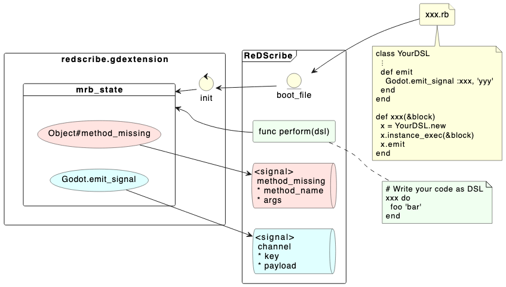
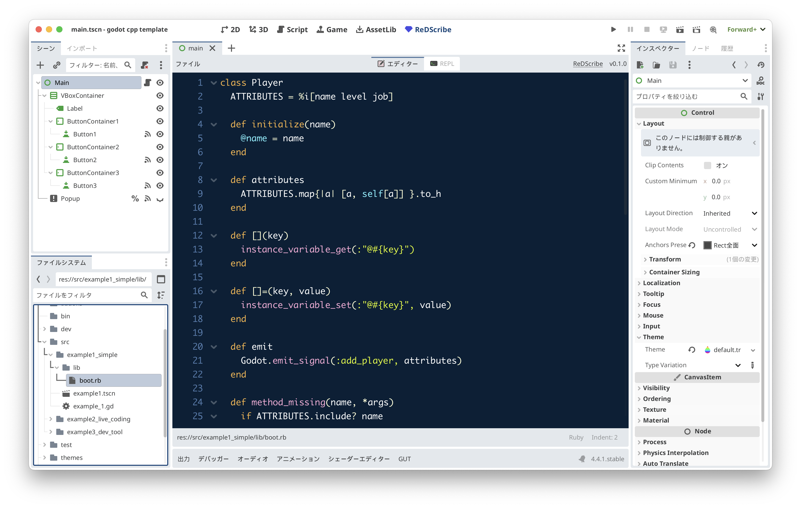
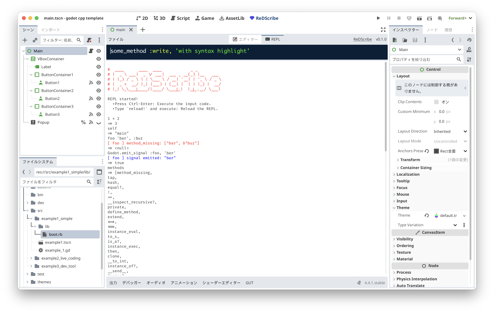

# ReDScribe
Let’s re-describe your code as your own friendly domain-specific language.


#### Features:
* **Execution**: You can execute mruby code in Godot and emit signals from mruby to Godot.
* **Editing**: You can write and edit Ruby files in the Godot Editor.
* **REPL**: You can try out Ruby code in Godot.


## Usage
```gdscript
extends Node

@onready var res := ReDScribe.new()

func _ready() -> void:
    res.method_missing.connect(_method_missing)
    res.channel.connect(_subscribe)
    res.perform("""
        Alice speak: "Hello Ruby!"

        require 'src/lib/player' # Your DSL definition file.

        player 'Alice' do
          level 1
          job   :magician
        end
    """)

func _method_missing(method_name: String, args: Array) -> void:
    print_debug('[method_missing] ', method_name, ': ', args)

func _subscribe(key: StringName, payload: Variant) -> void:
    print_debug('[subscribe] ', key, ': ', payload)


# -- Output --
#
#   [method_missing] Alice: [{ &"speak": "Hello Ruby!" }]
#
#   [subscribe] add_player: { &"name": "Alice", &"level": 1, &"job": &"magician" }
#
```

## Architecture



## Built-in methods

| mruby                             | description                          |
|-----------------------------------|--------------------------------------|
| `require 'path/to/file'`          | loads `res://path/to/file.rb` file.  |
| `puts 'something'`                | prints `something` in Godot console. |
| Object#method_missing             | emits `method_missing` signal.<br> `(method_name: String, args: Array)` |
| `Godot.emit_signal(key, payload)` | emits `channel` signal.<br> `(key: StringName, payload: Variant)`       |
| `Godot::VERSION`                  | Godot version                        | 


## Type conversions

| mruby      |   | gdscript                    |
|------------|---|-----------------------------|
| true       | ⇒ | true                        |
| false      | ⇒ | false                       |
| nil        | ⇒ | null                        |
| Float      | ⇒ | float                       |
| Integer    | ⇒ | int                         |
| Symbol     | ⇒ | StringName                  |
| String     | ⇒ | String                      |
| Hash       | ⇒ | Dictionary                  |
| Array      | ⇒ | Array                       |
| Range      | ⇒ | Array                       |
| Time       | ⇒ | Dictionary                  |
| (others)   | ⇒ | String<br>(#inspect called) |

see: [demo/test/test_variant.gd](https://github.com/tkmfujise/ReDScribe/blob/main/demo/test/test_variant.gd)


## Screenshots
### Editor


### REPL



## Roadmap

### v0.1.0
* [x] method_missing signal
* [x] channel signal
* [x] Godot module
* [x] puts
* [x] boot.rb
* [x] require
* [x] Editor
* [x] REPL
* [x] compile
  * [x] debug/release
  * [x] windows
  * [x] mac
* [ ] Document
  * [x] doc/*.adoc
  * [ ] README
  * [x] Godot help
* [ ] Demo
  * [x] Example1: Simple
  * [x] Example2: Live Coding
  * [ ] Example3: Dev tool


### v0.2.0
* [ ] Document
  * [ ] Wiki
* [ ] Editor
  * [ ] Snippet
    * [ ] require
  * [ ] User definable theme
  * [ ] User definable syntax
* [ ] remove bugs
  * [ ] `.rb` files cannot be displayed on the first launch.
  * [ ] `#` comment not working in REPL
* [ ] remove WARNING
  * [ ] (Windows) invalid UID: uid://xxx - using text path instead: res://yyy. I fixed it on macOS, but it appears on Windows instead.
* [ ] src/*.cpp
  * [ ] remove global variables
* [ ] compile
  * [ ] use github workflow
  * [ ] target
    * [x] windows.x86_64 
    * [ ] windows.x86_32 
    * [x] macos
    * [ ] linux.x86_64 
    * [ ] linux.arm64 
    * [ ] linux.rv64 
    * [ ] android.x86_64 
    * [ ] android.arm64 
    * [ ] ios


